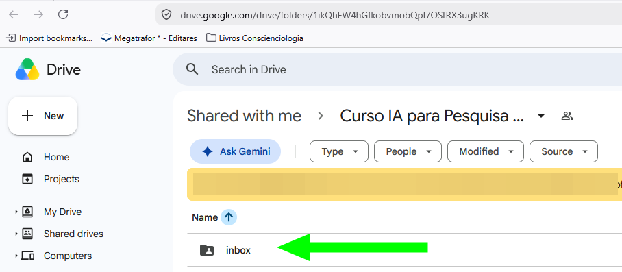

**Público-alvo:** participantes do grupo de WhatsApp *"CIT/CEAEC - Curso Institucional de IA nas pesquisas conscienciológicas"*.

:::caution[Isto é uma proposta, não uma decisão]
Este curso inteiro — do início ao fim — descreve uma **proposta em avaliação pelo grupo**, não um processo já adotado. Nomes de campos, estados, papéis, identificadores: tudo pode mudar com o uso real. Onde algo parecer definitivo demais, é falha de redação, não intenção.

Também não é uma cópia da proposta original: ensina a **usar** o que já está em `curadoria/` neste mesmo repositório, sempre linkando para lá como fonte — para não termos duas versões competindo como "oficial".
:::

## O problema

Boa parte do conhecimento que o grupo produz ou encontra fica disperso nas conversas, nos arquivos pessoais e nos diferentes serviços que cada um usa. Um conteúdo interessante gera uma boa discussão no WhatsApp e, semanas depois, fica difícil de achar de novo.

Estamos investigando:

> Como transformar o fluxo de informações, conteúdos e discussões do grupo em conhecimento organizado, contextualizado, criticamente analisado e reutilizável, usando IA como assistente — sem delegar a ela o discernimento humano?

## O fluxo em quatro ambientes

```text
WhatsApp                    Inbox                  IA + participante          GitHub
compartilhamento    →    preservação do    →    pré-curadoria        →    registro do
e discussão               material a analisar     (com auxílio de IA)      conhecimento curado
```

Cada ambiente responde a uma pergunta diferente — isso volta na próxima aula.

## Onde fica o Inbox, na prática

O Inbox é uma pasta no Google Drive. O link para ela está fixado na **descrição do grupo de WhatsApp** do CIT/CEAEC — abra o grupo, veja os dados do grupo, e o link estará lá.



:::tip[]
Vale entrar na pasta agora, só para conhecer — não precisa fazer nada nela ainda. Lembre-se: colocar um material lá não é aprovação de nada, é só dizer "isto pode merecer análise" (mais sobre isso na próxima aula).
:::

## O princípio que organiza tudo

> **A IA pode propor. O participante analisa. O grupo pode revisar.**

A IA nunca é autoridade sobre o conteúdo, árbitro da verdade, ou representante do consenso grupal. A responsabilidade pela interpretação, avaliação, decisão e publicação é sempre humana.

:::tip[Fonte completa]
[curadoria/PROPOSTA.md](https://github.com/conscienciologia/prototipos/blob/main/curadoria/PROPOSTA.md) — o porquê do projeto, por extenso.
:::
